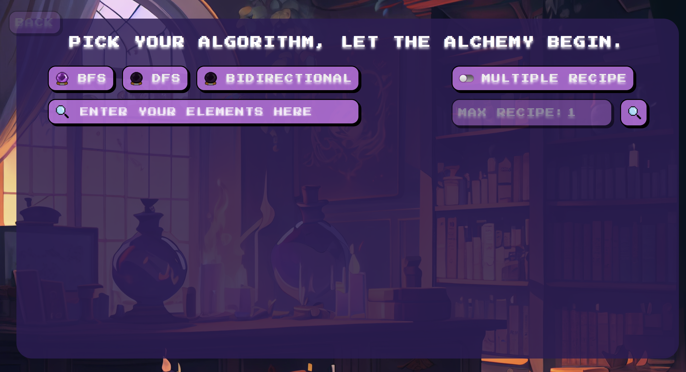
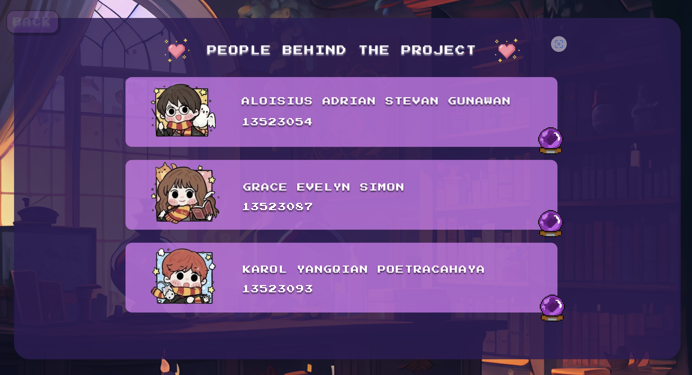

<h1 align="center">⚗️ Tugas Besar 2 IF2211 Strategi Algoritma ⚗️</h1>
<h1 align="center">Pemanfaatan Algoritma BFS dan DFS dalam Pencarian Recipe pada Permainan Little Alchemy 2</h1>


## 📌 Daftar Isi 
1. [Informasi Umum](#informasi-umum)
2. [Kontributor](#kontributor)
3. [Fitur](#fitur)
4. [Kebutuhan Program](#kebutuhan-program)
5. [Cara Menjalankan Program](#cara-menjalankan-program)
6. [Status Proyek](#status-proyek)
7. [Struktur Proyek](#struktur-proyek)
8. [Gambaran Program](#gambaran-program)
9. [Video Bonus](#video-bonus)

## 📌 Informasi Umum
Little Alchemy 2 adalah sebuah permainan berbasis web/aplikasi yang dikembangkan oleh Recloak dan dirilis pada tahun 2017. Tujuan dari permainan ini adalah untuk membuat 720 elemen dari 4 elemen dasar yang tersedia, yaitu _air_ (udara), _earth_ (tanah), _fire_ (api), dan _water_ (air). Mekanisme permainan ini adalah pemain dapat menggabungkan dua elemen dengan melakukan _drag and drop_ Jika kombinasi kedua elemen valid, akan muncul elemen baru; jika tidak valid, tidak akan terjadi apa-apa.

Proyek ini bertujuan untuk membangun sebuah aplikasi yang dapat menyelesaikan permainan Little Alchemy 2 dengan mencari _recipe_ (resep) untuk membuat elemen-elemen turunan dari elemen dasar. Aplikasi ini mengimplementasikan dua algoritma pencarian graf, yaitu _Breadth-First Search_ (BFS) dan _Depth-First Search_ (DFS). BFS adalah algoritma pencarian yang menjelajahi semua simpul pada tingkat kedalaman yang sama sebelum melanjutkan ke tingkat kedalaman berikutnya. Sementara itu, DFS adalah algoritma pencarian yang menjelajahi graf dengan bergerak sedalam mungkin pada setiap cabang sebelum melakukan _backtracking_ untuk menjelajahi jalur lainnya. Aplikasi ini memungkinkan pengguna untuk mencari jalur pembuatan elemen dan memvisualisasikannya.

## 📌 Kontributor
### **Kelompok ian**
|     NIM    |                  Nama                  |
| :--------: | :------------------------------------: |
| 13523054   | Aloisius Adrian Stevan Gunawan         |
| 13523087   | Grace Evelyn Simon                     |
| 13523093   | Karol Yangqian Poetracahya             |

## 📌 Fitur
Fitur-fitur yang tersedia dalam program ini adalah:
| NO  | Fitur                                            | Deskripsi                                                                                                                                  |
|:---:|--------------------------------------------------|--------------------------------------------------------------------------------------------------------------------------------------------|
| 1   | Pencarian dengan Algoritma BFS                   | Aplikasi dapat mencari _recipe_ elemen menggunakan algoritma _Breadth-First Search_.|
| 2   | Pencarian dengan Algoritma DFS                   | Aplikasi dapat mencari _recipe_ elemen menggunakan algoritma _Depth-First Search_.|
| 3   | Mode Pencarian Resep         | Terdapat tombol _toggle_ untuk memilih mode pencarian satu _recipe_ terpendek atau mencari beberapa _recipe_ (multiple recipe).|
| 4   | Parameter Jumlah Resep (untuk Mode Multiple)        | Jika mode pencarian banyak _recipe_ dipilih, pengguna dapat memasukkan jumlah maksimal _recipe_ yang ingin dicari.|
| 5   | Visualisasi Pohon _Recipe_                       | Hasil pencarian _recipe_ divisualisasikan sebagai sebuah pohon yang menunjukkan kombinasi elemen yang diperlukan dari elemen dasar.|
| 6   | Informasi Pencarian                            | Aplikasi menampilkan waktu pencarian dan jumlah simpul (_node_) yang dikunjungi selama proses pencarian.|

## 📌 Kebutuhan Program
| NO  | Kebutuhan Program        | Tautan Referensi                                                                 |
| :---: |--------------------------|----------------------------------------------------------------------------------|
| 1   | Next.js (React.js)       | [Next.js](https://nextjs.org/docs) 
| 2   | Bahasa Pemrograman Go    | [The Go Programming Language](https://go.dev/doc/)|
| 3   | Node.js (untuk Next.js)  | [Node.js](https://nodejs.org/)|
| 4   | Docker (Opsional)        | [Docker Desktop](https://www.docker.com/products/docker-desktop/)  |
| 5   | Pustaka Go: goquery      | [goquery](https://github.com/PuerkitoBio/goquery) |
| 6   | Pustaka Go: gorilla/mux  | [gorilla/mux](https://github.com/gorilla/mux) |
| 7   | Pustaka JS: Tailwind CSS | [Tailwind CSS](https://tailwindcss.com/docs) |
| 8   | Pustaka JS: Vis.js       | [Vis.js Network](https://visjs.github.io/vis-network/docs/network/) |

## 📌 Cara Menjalankan Program

### A. Tanpa Menggunakan Docker

#### 1. Clone Repository
   1. Buka terminal.
   2. Clone repository Frontend: `git clone https://github.com/karolyangqian/Tubes2_FE_ian.git`
   3. Clone repository Backend: `git clone https://github.com/graceevelyns/Tubes2_BE_ian.git`

#### 2. Menjalankan Backend (Server Go)
   1. Pindah direktori ke folder repository Backend yang telah di-clone.
      ```bash
      cd Tubes2_BE_ian
      ```
   2. (Jika belum ada) Unduh _dependency_ yang dibutuhkan:
      ```bash
      go get github.com/PuerkitoBio/goquery
      go get github.com/gorilla/mux
      ```
      (Catatan: `go mod tidy` juga dapat digunakan untuk mengelola dependensi jika file `go.mod` sudah ada).

   3. Jalankan program backend:
      ```bash
      go run src/cmd/main.go
      ```
      Server backend akan berjalan (`http://localhost:8080`). Proses ini juga akan melakukan _scraping_ data dari Fandom Wiki Little Alchemy 2.

#### 3. Menjalankan Frontend (Aplikasi Next.js)
   1. Pindah direktori ke folder repository Frontend yang telah di-clone.
      ```bash
      cd Tubes2_FE_ian
      cd avogadra-kedavro
      ```
   2. Instal _dependency_ yang dibutuhkan (jika ini pertama kali atau ada perubahan):
      ```bash
      npm install
      ```
   3. Buat file `.env` di root directory project lalu tambahkan environment variable berikut:
      ```bash
      NEXT_PUBLIC_API_URL=http://localhost:8080
      ```
   3. Jalankan server frontend:
      ```bash
      npm start
      ```
   4. Buka browser dan akses alamat yang ditampilkan di terminal (`http://localhost:3000`).

#### 4. Cara Menggunakan Aplikasi Web
   1. Aplikasi juga dapat diakses melalui: [tubes2-fe-ian.vercel.app](https://tubes2-fe-ian.vercel.app)
   2. Pada halaman utama, masukkan nama elemen yang ingin dicari resepnya pada kolom input.
   3. Pilih algoritma pencarian (BFS atau DFS).
   4. Aktifkan _toggle_ "MULTIPLE RECIPE" jika ingin mencari lebih dari satu resep. Jika diaktifkan, masukkan jumlah maksimal resep yang diinginkan.
   5. Klik tombol ikon kaca pembesar untuk memulai pencarian.
   6. Hasil pencarian berupa pohon resep, waktu eksekusi, dan jumlah node yang ditelusuri akan ditampilkan.

### B. Menggunakan Docker
   Pastikan Docker Desktop sudah terinstal dan berjalan.

#### 1. Menjalankan Frontend dengan Docker
   1. Pindah direktori ke folder repository Frontend (`Tubes2_FE_ian`).
   2. Build Docker image untuk Frontend:
      ```bash
      docker build --no-cache -t avogadra-kedavro-fe:latest .
      ```
   3. Jalankan Docker container untuk Frontend:
      ```bash
      docker run -p 3000:3000 -e NEXT_PUBLIC_API_URL="[http://host.docker.internal:8080](http://host.docker.internal:8080)" --rm --name frontend avogadra-kedavro-fe:latest
      ```
      Frontend akan dapat diakses melalui `http://localhost:3000`. Variabel `NEXT_PUBLIC_API_URL` diatur agar Frontend dapat berkomunikasi dengan Backend yang berjalan di host.

#### 2. Menjalankan Backend dengan Docker
   1. Pindah direktori ke folder repository Backend (`Tubes2_BE_ian`).
   2. Load Docker image Backend dari file `.tar`:
      ```bash
      docker load -i avogadra-kedavro-be.tar
      ```
   3. Jalankan Docker container untuk Backend:
      ```bash
      docker run -p 8080:8080 --rm --name backend tubes2be-ian-app:latest
      ```
      Backend akan berjalan dan terekspos pada port `8080`.

## 📌 Status Proyek
Proyek ini telah **selesai** dikerjakan dan memenuhi spesifikasi wajib yang diberikan.

## 📌 Struktur Proyek
Struktur direktori umum untuk proyek ini (dengan repository terpisah untuk Frontend dan Backend):

**Repository Frontend (`Tubes2_FE_ian`):**
```bash
.
├── README.md
├── app
└── avogadra-kedavro
    ├── Dockerfile
    ├── README.md
    ├── eslint.config.mjs
    ├── jsconfig.json
    ├── next.config.mjs
    ├── node_modules
    ├── package-lock.json
    ├── package.json
    ├── postcss.config.mjs
    ├── public
    └── src
```

**Repository Backend (`Tubes2_BE_ian`):**
```bash
.
├── Dockerfile
├── README.md
├── api
│   └── index.go
├── avogadra-kedavro-be.tar
├── doc
├── docs
│   ├── docs.go
│   ├── swagger.json
│   └── swagger.yaml
├── go.mod
├── go.sum
├── src
│   └── cmd
│       ├── docs
│       │   ├── docs.go
│       │   ├── swagger.json
│       │   └── swagger.yaml
│       ├── internal
│       │   ├── algorithm
│       │   │   ├── BFSal.go
│       │   │   └── DFSal.go
│       │   ├── api
│       │   │   └── handler.go
│       │   ├── model
│       │   │   └── element.go
│       │   └── scraper
│       │       └── scraper.go
│       └── main.go
└── vercel.json
```

## 📌 Gambaran Program




## 📌 Video Bonus
https://youtu.be/-NADok-gNOo